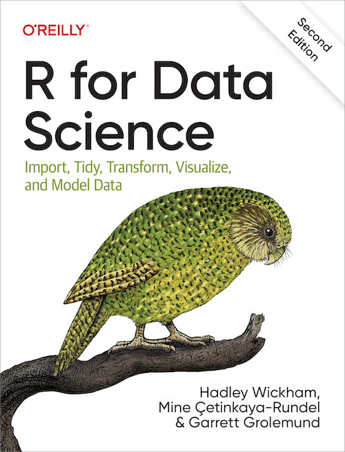
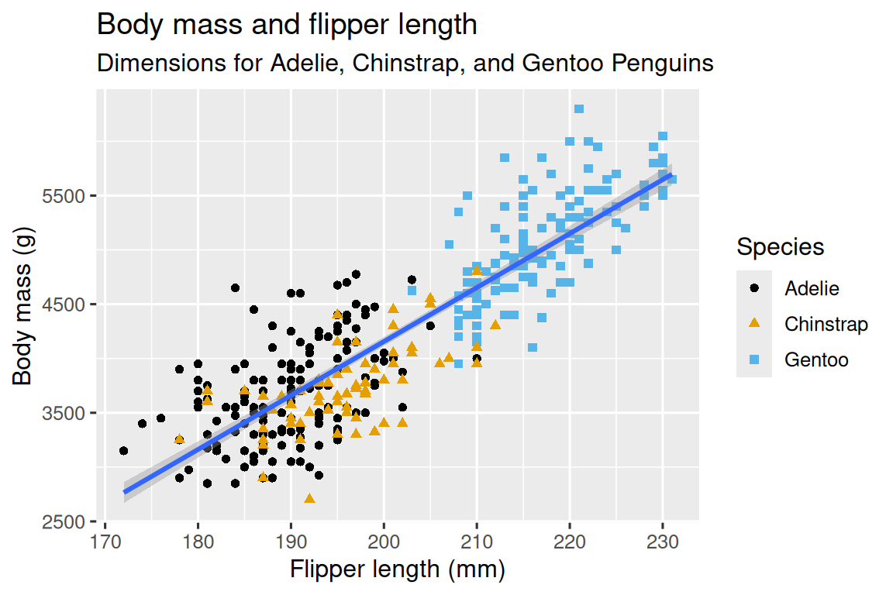
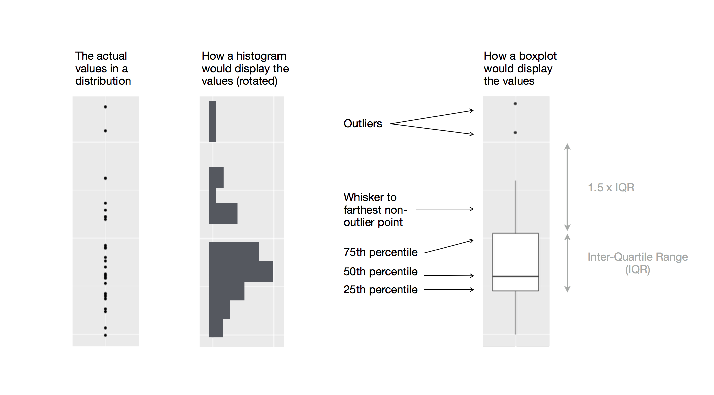

## Who am I

Martin Jonsson

Assistant professor at KI

Works with cardiac arrest research

## Outline

Todays presentation is about the ggplot2 package

The presentation is heavily inspired by chapter 1 in the book *R for Data Science (2nd edition)*

Most of the examples in this presentation is presented in the book <https://r4ds.hadley.nz/>

{width="400"}

## Outline

The presentation will introduce the most common plots

We will have breaks for exercises

The presentation is available at <https://jonssonmartin.github.io/DataViz26/>

## Install packages

The first step is to install packages needed for the examples

To install and load package, you write:

```{r, echo=F}
#| classes: shrink-code
library(tidyverse)

```

```{r, eval=FALSE}
#| classes: shrink-code

install.packages("tidyverse") #<1>

library(tidyverse) # <2>

```

1.  You only need to install packages once
2.  You need to load the packages every time you start a new session

## Tidyverse

The tidyverse is a collection of packages that include very useful packages such as `ggplot2` and `dplyr`


## Additional packages

We will install another package to have some additional data

The package is called `palmerpenguins` and contains the `penguins` dataset

```{r, echo=F}
#| classes: shrink-code
library(palmerpenguins)
library(ggthemes)
```

```{r, eval=FALSE}
#| classes: shrink-code

install.packages("palmerpenguins") # <1>
install.packages("ggthemes") # <2>
library(palmerpenguins) # <3>
library(ggthemes) # <4>

data(penguins) # <5>
head(penguins) # <6>
```

1.  Installs the package `palmerpenguins`
2.  Installs the package `ggthemes` which is used for colors later in the presentation
3.  Load the package `palmerpenguins`
4.  Load the package `ggthemes`
5.  Load the dataset `penguins` from the `palmerpenguins` package
6.  Show the first rows of the dataset `penguins`

## Check variable names

```{r}
#| classes: shrink-code

glimpse(penguins)

```

## Ultimate goal

To produce this plot

{width="634"}

## Creating a plot

If nothing is specified in a plot. Nothing is printed

You can see this as an empty canvas

```{r}
#| classes: shrink-code

ggplot(penguins)
```

## (Aestetic) Mapping

We need to tell R how to map the data. We do that by specifying the `aes()` argument.

However, no data is visible yet.

```{r}
#| classes: shrink-code
ggplot(
  data = penguins,
  mapping = aes(x = flipper_length_mm, # <1>
                y = body_mass_g)) # <2>

```

1.  We put the flipper length on the `x` axis
2.  and the body mass on the `y` axis

## Geoms

By specifying `geom_point()` ggplot know how to plot it

A scatter plot is created

```{r}
#| classes: shrink-code
ggplot(
  data = penguins,
  mapping = aes(x = flipper_length_mm, 
                y = body_mass_g)) +
  geom_point() # <1>

```

1.  The `geom_point()` function plots the points

## Work with aestehtics and layers

Colors can be added by specifying which variable should be coloring the points

```{r}
#| classes: shrink-code
ggplot(
  data = penguins,
  mapping = aes(x = flipper_length_mm, 
                y = body_mass_g, 
                color = species)) + # <1> 
  geom_point()
```

1.  The variable "species" should color the points

## Regression lines

To add regression lines we can use the `geom_smooth()` function.

It adds a new geom to the plot

```{r}
#| classes: shrink-code
ggplot(
  data = penguins,
  mapping = aes(x = flipper_length_mm, 
                y = body_mass_g, 
                color = species)) +
  geom_point() +
  geom_smooth(method = "lm") # <1>
```

1.  Within this argument we specify method. `lm` stands for linear model

## Lets go back to the "ultimate goal"-plot

Our goal is to have one regression line for all points

{width="534"}

## Global vs local Aestetics

::::: columns
::: {.column width="50%"}
Global Aestetics

-   within `ggplot()`

-   Apply to all layers

    ```{r, eval=FALSE}
    #| classes: shrink-code
    ggplot(
      data = penguins,
      mapping = aes(x = flipper_length_mm, 
                    y = body_mass_g, 
                    color = species)) + # <1>
      geom_point() +
      geom_smooth(method = "lm")
    ```

    1.  Color is specified within `ggplot()`
:::

::: {.column width="50%"}
Local Aestetics

-   Within `geom_*()`

-   Apply to specific layer

    ```{r, eval=FALSE}
    #| classes: shrink-code
    ggplot(
      data = penguins,
      mapping = aes(x = flipper_length_mm, 
                    y = body_mass_g)) +
      geom_point(mapping=aes(color = species)) + # <2>
      geom_smooth(method = "lm")

    ```

    2.  Color is specified within `geom_point()`
:::
:::::

## Results

::::: columns
::: {.column width="50%"}
Global Aestetics

```{r}
#| classes: shrink-code
ggplot(
  data = penguins,
  mapping = aes(x = flipper_length_mm, 
                y = body_mass_g, 
                color = species)) + # <1>
  geom_point() + geom_smooth(method = "lm")
```

1.  Color is specified within `ggplot()`
:::

::: {.column width="50%"}
Local Aestetics

```{r}
#| classes: shrink-code
ggplot(
  data = penguins,
  mapping = aes(x = flipper_length_mm, 
                y = body_mass_g)) +
  geom_point(mapping=aes(color = species)) + # <2>
  geom_smooth(method = "lm")

```

2.  Color is specified within `geom_point()`
:::
:::::

## If we want 1 line, specify it locally

We move the color argument from the global `ggplot()` to the local `geom_point()`

```{r}
#| classes: shrink-code
ggplot(
  data = penguins,
  mapping = aes(x = flipper_length_mm, 
                y = body_mass_g)) +
  geom_point(mapping = aes(color = species)) + # <1>
  geom_smooth(method = "lm")
```

1.  the color is moved from within `ggplot()` to `geom_point()`

## Add different shapes to the points

Sometimes plots can be hard to read due to similar colors or if the reader has color blindness

```{r}
#| classes: shrink-code
#| fig-width: 6
#| fig-height: 4
ggplot(
  data = penguins,
  mapping = aes(x = flipper_length_mm, 
                y = body_mass_g)) +
  geom_point(mapping = aes(color = species, 
                           shape = species)) + # <1>
  geom_smooth(method = "lm")
```

1.  Add `shape` to change the shape of the points

## Specify the colors and the labels

By adding `scale_color_colorblind()` and `labs()` we can change the colors

```{r}
#| classes: shrink-code
#| fig-width: 6
#| fig-height: 4

library(ggthemes)
ggplot(
  data = penguins,
  mapping = aes(x = flipper_length_mm, 
                y = body_mass_g)) + 
  geom_point(aes(color = species, 
                   shape = species)) +
  geom_smooth(method = "lm") +
  labs(title = "Body mass and flipper length", # <1>
       subtitle = "Dimensions for Adelie, Chinstrap, and Gentoo Penguins", # <2>
       x = "Flipper length (mm)", y = "Body mass (g)", # <3>
       color = "Species", shape = "Species" # <4>
  ) +
  scale_color_colorblind() # <5>
```

1.  `title` adds a title to the plot
2.  `subtitle` adds a subtitle
3.  Specify the text on the `x` and `y` axis
4.  `color` and `shape` changes the text in the leged
5.  `scale_color_colorblind()` changes the color of the points

# **Exercises** 1

## **Exercises 1**

1.  How many rows are in `penguins`? How many columns?
2.  What does the `bill_depth_mm` variable in the `penguins` data frame describe? Read the help for [`?penguins`](https://allisonhorst.github.io/palmerpenguins/reference/penguins.html) to find out.
3.  Make a scatterplot of `bill_depth_mm` vs. `bill_length_mm`. That is, make a scatterplot with `bill_depth_mm` on the y-axis and `bill_length_mm` on the x-axis. Describe the relationship between these two variables.

## **Exercises 1**

4.  What happens if you make a scatterplot of `species` vs. `bill_depth_mm`? What might be a better choice of geom?

5.  Why does the following give an error and how would you fix it?

    ```{r, eval=FALSE}
    #| classes: shrink-code

    ggplot(data = penguins) + 
      geom_point()
    ```

6.  What does the `na.rm` argument do in [`geom_point()`](https://ggplot2.tidyverse.org/reference/geom_point.html)? What is the default value of the argument? Create a scatterplot where you successfully use this argument set to `TRUE`.

## **Exercises 1**

7.  Add the following caption to the plot you made in the previous exercise: “Data come from the palmerpenguins package.” Hint: Take a look at the documentation for [`labs()`](https://ggplot2.tidyverse.org/reference/labs.html).
8.  Recreate the following visualization. What aesthetic should `bill_depth_mm` be mapped to? And should it be mapped at the global level or at the geom level?

```{r, echo=FALSE}
#| classes: shrink-code
#| fig-width: 6
#| fig-height: 4
ggplot(
  data = penguins,
  mapping = aes(x = flipper_length_mm, 
                y = body_mass_g)) +
  geom_point(mapping = aes(color = bill_depth_mm)) + # <1>
  geom_smooth(method = "loess")
```

## Exercises 1

9.  Run this code in your head and predict what the output will look like. Then, run the code in R and check your predictions.

```{r, eval=F}
#| classes: shrink-code
#| fig-width: 6
#| fig-height: 4

ggplot(data = penguins,
       mapping = aes(x = flipper_length_mm, 
                     y = body_mass_g, 
                     color = island)) +
  geom_point() +
  geom_smooth(se = FALSE)
```

10. Will these two graphs look different? Why/why not?

::::: columns
::: {.column width="50%"}
```{r, eval=FALSE}
#| fig-width: 6
#| fig-height: 4
#| classes: shrink-code
ggplot(data = penguins,
       mapping = aes(x = flipper_length_mm, 
                     y = body_mass_g)) +
  geom_point() +
  geom_smooth()

```
:::

::: {.column width="50%"}
```{r, eval=FALSE}
#| classes: shrink-code
#| fig-width: 6
#| fig-height: 4
ggplot() +
  geom_point(data = penguins,
             mapping = aes(x = flipper_length_mm, 
                           y = body_mass_g)) +
  geom_smooth(data = penguins,
              mapping = aes(x = flipper_length_mm, 
                            y = body_mass_g))

```
:::
:::::

# Different way of writing code

## Code can be be written more efficient

-   In the previous example we have written `data=` and `mapping=`

```{r}
#| classes: shrink-code
#| fig-width: 6
#| fig-height: 4
ggplot(data = penguins, # <1>
       mapping = aes(x = flipper_length_mm, # <2>
                     y = body_mass_g)) +
  geom_point()

```

1.  Data is specified with `data=`
2.  Mapping is specified with `mapping=`

## We can rewrite the code to produce the same plot

```{r}
#| classes: shrink-code
#| fig-width: 6
#| fig-height: 4
ggplot(penguins, aes(x = flipper_length_mm, # <1>
                     y = body_mass_g)) + 
  geom_point()
```

1.  Notice that data and mapping is removed

## Another way to write it

We case use the pipe `|>`

We then start with the data frame `penguins` "and then" use the function ggplot()

```{r}
#| classes: shrink-code
#| fig-width: 6
#| fig-height: 4
penguins |> 
  ggplot(aes(x = flipper_length_mm, # <1>
             y = body_mass_g)) + 
  geom_point()
```

1.  Notice that we do not have to specify data within `ggplot()` or `geom_point()`

## A third way

You can also specify everything within the geom_point()

```{r}
#| classes: shrink-code
#| fig-width: 6
#| fig-height: 4
#| 

ggplot() + 
geom_point(data=penguins, aes(x = flipper_length_mm,
                              y = body_mass_g)) # <1>
                 
```

# Visualizing distributions

## Categorial variable

The example before have only produced scatter plots.

Sometimes we want different kinds of plots, such as a bar plot ([geom_bar()](https://ggplot2.tidyverse.org/reference/geom_bar.html))

```{r}
#| classes: shrink-code
#| fig-width: 6
#| fig-height: 4

ggplot(penguins, aes(x = species)) + # <1>
  geom_bar() # <2>
```

1.  Notice that we only need to specify one variable
2.  `geom_bar()` produce a bar plot

## Often we want to reorder our categories

It is generally preferable to order categories by frequencies

we can do that by using the `fct_infreq()` function (factor in frequencies) from the forcats package (included in tidyverse)

```{r}
#| classes: shrink-code
#| fig-width: 6
#| fig-height: 4

ggplot(penguins, aes(x = fct_infreq(species))) + # <1>
  geom_bar()
```

1.  Put species within the `fct_infreq()` function

## Numerical variables

Numerical variables (quantitative) can be shown as a distribution

## Histograms

Histograms are a very useful way to inspect data

```{r}
#| classes: shrink-code
#| fig-width: 6
#| fig-height: 4

ggplot(penguins, aes(x = body_mass_g)) +
  geom_histogram(binwidth = 200) # <1>
```

1.  `geom_histogram()` produces a histogram. Binwidths can be changed

## Binwidths matter

::::: columns
::: {.column width="50%"}
```{r}
#| classes: shrink-code
ggplot(penguins, aes(x = body_mass_g)) +
  geom_histogram(binwidth = 20) # <1>
```

1.  Small binwidth
:::

::: {.column width="50%"}
```{r}
#| classes: shrink-code
ggplot(penguins, aes(x = body_mass_g)) +
  geom_histogram(binwidth = 2000) # <2>

```

2.  Small binwidth
:::
:::::

## Density plots

A density plot is a smoothed version of a histogram. Written like [geom_density()](https://ggplot2.tidyverse.org/reference/geom_density.html)

```{r}
#| classes: shrink-code
#| fig-width: 6
#| fig-height: 4

ggplot(penguins, aes(x = body_mass_g)) +
  geom_density()

```

## Density plot vs histogram

Similar patterns in both plots

::::: columns
::: {.column width="50%"}
```{r}
#| classes: shrink-code
ggplot(penguins, aes(x = body_mass_g)) +
  geom_density()
```
:::

::: {.column width="50%"}
```{r}
#| classes: shrink-code
ggplot(penguins, aes(x = body_mass_g)) +
  geom_histogram(binwidth = 1)

```
:::
:::::

# **Exercises** 2

## Excercises 2

1.  Make a bar plot of `species` of `penguins`, where you assign `species` to the `y` aesthetic. How is this plot different?
2.  How are the following two plots different? Which aesthetic, `color` or `fill`, is more useful for changing the color of bars?

::::: columns
::: {.column width="50%"}
```{r, eval=FALSE}
#| classes: shrink-code
ggplot(penguins, aes(x = body_mass_g)) +
  geom_density()
```
:::

::: {.column width="50%"}
```{r, eval=FALSE}
#| classes: shrink-code
ggplot(penguins, aes(x = body_mass_g)) +
  geom_histogram(binwidth = 1)

```
:::
:::::

## Excercises 2

3.  What does the `bins` argument in [geom_histogram()](https://ggplot2.tidyverse.org/reference/geom_histogram.html) do?

4.  Make a histogram of the `carat` variable in the `diamonds` dataset that is available when you load the tidyverse package. Experiment with different binwidths. What binwidth reveals the most interesting patterns?

    ```{r}
    data(diamonds)
    head(diamonds)
    ```

# Visualising relationships

The scatter plot we did before is an example of a visualised relationship

```{r}
#| classes: shrink-code
#| fig-width: 6
#| fig-height: 4

library(ggthemes)
ggplot(penguins, aes(x = flipper_length_mm, 
                     y = body_mass_g)) + 
  geom_point(aes(color = species, 
                 shape = species)) +
  labs(title = "Body mass and flipper length", 
       subtitle = "Dimensions for Adelie, Chinstrap, and Gentoo Penguins", 
       x = "Flipper length (mm)", y = "Body mass (g)", 
       color = "Species", shape = "Species") +
  scale_color_colorblind()
```

## What if we have one continuous and one categorial variable

If one variable is categorial, a [geom_boxplot()](https://ggplot2.tidyverse.org/reference/geom_boxplot.html) is a good choice

{width="791"}

```{r}
#| classes: shrink-code
#| fig-width: 6
#| fig-height: 4
ggplot(penguins, aes(x = species, y = body_mass_g)) +
  geom_boxplot()
```

## Density plot for different groups

The distribution per `species` can be shown using [geom_density()](https://ggplot2.tidyverse.org/reference/geom_density.html)

```{r}
#| classes: shrink-code
#| fig-width: 6
#| fig-height: 4
ggplot(penguins, aes(x = body_mass_g, color = species)) +
  geom_density(linewidth = 0.75) # <1>
```

1.  The width of the lines can be specified using the linewidth argument

## Density plot for different groups

We can fill the densities by specifying `fill=`

```{r}
#| classes: shrink-code
#| fig-width: 6
#| fig-height: 4
ggplot(penguins, aes(x = body_mass_g, 
                     color = species, 
                     fill = species)) + # <1>
  geom_density(alpha = 0.5) # <2>
```

1.  add `fill=species`
2.  the `alpha` argument alters the transparency of the fill

## Two categorial variables

If we want to visualise two categorial variables. A barplot can be used

It is specified with the [geom_bar()](https://ggplot2.tidyverse.org/reference/geom_bar.html) function

```{r}
#| classes: shrink-code
#| fig-width: 6
#| fig-height: 4
ggplot(penguins, aes(x = island, 
                     fill = species)) +
  geom_bar()
```

## Two categorial variables

By default it calculates counts, If we want proportions we need to specify `position`

```{r}
#| classes: shrink-code
#| fig-width: 6
#| fig-height: 4

ggplot(penguins, aes(x = island, 
                     fill = species)) +
  geom_bar(position = "fill") # <1>

```

1.  The `position="fill"` argument changes the y axis to proportions

## Change y-label

ggplot does not change the labels if `position` is changed. You need to alter that yourself

```{r}
#| classes: shrink-code
#| fig-width: 6
#| fig-height: 4

ggplot(penguins, aes(x = island, fill = species)) +
  geom_bar(position = "fill") +
  labs(y = "proportion")

```

## Two numerical variables

In the first examples we produced a scatter plot using [geom_point()](https://ggplot2.tidyverse.org/reference/geom_point.html)

```{r}
ggplot(penguins, aes(x = flipper_length_mm, 
                     y = body_mass_g)) +
  geom_point()
```

## Our "goal plot"

We color our observations using 1 variable `species`

```{r}
#| classes: shrink-code
#| fig-width: 6
#| fig-height: 4

library(ggthemes)
ggplot(penguins, aes(x = flipper_length_mm, 
                     y = body_mass_g)) + 
  geom_point(aes(color = species, 
                 shape = species)) +
  labs(title = "Body mass and flipper length", 
       subtitle = "Dimensions for Adelie, Chinstrap, and Gentoo Penguins", 
       x = "Flipper length (mm)", y = "Body mass (g)", 
       color = "Species", shape = "Species") +
  scale_color_colorblind()
```

## It get messy quickly

if we add another variable (`shape=island`) it gets messy

```{r}
#| classes: shrink-code
#| fig-width: 6
#| fig-height: 4

library(ggthemes)
ggplot(penguins, aes(x = flipper_length_mm, 
                     y = body_mass_g)) + 
  geom_point(aes(color = species, 
                 shape = island)) +
  labs(title = "Body mass and flipper length", 
       subtitle = "Dimensions for Adelie, Chinstrap, and Gentoo Penguins", 
       x = "Flipper length (mm)", y = "Body mass (g)", 
       color = "Species", shape = "Island") +
  scale_color_colorblind()
```

## Facets

This problem can be solved using facets

```{r}
#| classes: shrink-code
#| fig-width: 8
#| fig-height: 4

library(ggthemes)
ggplot(penguins, aes(x = flipper_length_mm, 
                     y = body_mass_g)) + 
  geom_point(aes(color = species, 
                 shape = species)) + # <1>
  labs(title = "Body mass and flipper length", 
       subtitle = "Dimensions for Adelie, Chinstrap, and Gentoo Penguins", 
       x = "Flipper length (mm)", y = "Body mass (g)", 
       color = "Species", shape = "Island") +
  scale_color_colorblind()+
  facet_wrap(~island) # <2> 
```

1.  We change `shape` back to `species`
2.  `facet_wrap()` splits the plot into different subplots based on island

# **Exercises** 3

## Exercises 3

1.  The `mpg` data frame that is bundled with the ggplot2 package contains 234 observations collected by the US Environmental Protection Agency on 38 car models. Which variables in `mpg` are categorical? Which variables are numerical? (Hint: Type [`?mpg`](https://ggplot2.tidyverse.org/reference/mpg.html) to read the documentation for the dataset.) How can you see this information when you run `mpg`?
2.  Make a scatterplot of `hwy` vs. `displ` using the `mpg` data frame. Next, map a third, numerical variable to `color`, then `size`, then both `color` and `size`, then `shape`. How do these aesthetics behave differently for categorical vs. numerical variables?

## Exercises 3

3.  In the scatterplot of `hwy` vs. `displ`, what happens if you map a third variable to `linewidth`?

<!-- -->

4.  What happens if you map the same variable to multiple aesthetics?
5.  Make a scatterplot of `bill_depth_mm` vs. `bill_length_mm` and color the points by `species`. What does adding coloring by species reveal about the relationship between these two variables? What about faceting by `species`?

## Exercises 3

6.  Why does the following yield two separate legends? How would you fix it to combine the two legends?

```{r}
#| classes: shrink-code
#| fig-width: 6
#| fig-height: 4
ggplot(penguins,
       aes(x = bill_length_mm, 
           y = bill_depth_mm, 
           color = species, 
           shape = species)) +
  geom_point() +
  labs(color = "Species")
```

## Exercises 3

7.  Create the two following stacked bar plots. Which question can you answer with the first one? Which question can you answer with the second one

::::: columns
::: {.column width="50%"}
```{r}
#| fig-width: 6
#| fig-height: 4
#| classes: shrink-code
#| 
ggplot(penguins, aes(x = island, 
                     fill = species)) +
  geom_bar(position = "fill")
```
:::

::: {.column width="50%"}
```{r}
#| fig-width: 6
#| fig-height: 4
#| classes: shrink-code
ggplot(penguins, aes(x = species, 
                     fill = island)) +
  geom_bar(position = "fill")
```
:::
:::::

# Saving your plots

## Saving your plots

When you have created your plot, you usually need to save it in another format

The function [ggsave()](https://ggplot2.tidyverse.org/reference/ggsave.html) is included in ggplot2

```{r}
#| fig-width: 6
#| fig-height: 4
#| classes: shrink-code

ggplot(penguins, aes(x = flipper_length_mm, 
                     y = body_mass_g)) +
  geom_point()

ggsave(filename = "~/Downloads/DataVisvt26/penguin-plot.png") # <1>

```

1.  If the plot is to saved as an object and specified, it will automatically save the last plot you ran

## Saving your plots

Height and width can be specified

by default it uses inches but can be specified using the `units=` argument

```{r}
#| fig-width: 6
#| fig-height: 4
#| classes: shrink-code

ggplot(penguins, aes(x = flipper_length_mm, 
                     y = body_mass_g)) +
  geom_point()

ggsave(filename = "~/Downloads/DataVisvt26/penguin-plot2.png",
       height = 10, # <1>
       width = 10, # <1>
       units = "cm") # <2>
```

1.  Height and width can be specified
2.  such as the units

## Saving your plots

You can specify the fileformat by changing the name of the plot (i.e. .png)

```{r}
#| fig-width: 6
#| fig-height: 4
#| classes: shrink-code

# PNG
ggsave(filename = "~/Downloads/DataVisvt26/plot.png", # <1>
       height = 10,
       width = 10,
       units = "cm",
       dpi=300) # <2>

# PDF
ggsave(filename = "~/Downloads/DataVisvt26/plot.pdf", # <3>
       height = 10,
       width = 10,
       units = "cm")

#SVG
ggsave(filename = "~/Downloads/DataVisvt26/plot.svg", # <4>
       height = 10,
       width = 10,
       units = "cm")

```

1.  If you want a .png file, you write .png at the end
2.  For pixelated formats you can specify dpi (dots per inch)
3.  If pdf write .pdf
4.  If svg write .svg

## Saving your plots

It is good practice to save your plot as an object

Otherwise the chance is that you overwrite your plots

```{r}
#| fig-width: 6
#| fig-height: 4
#| classes: shrink-code


penguin_plot1 <- ggplot(penguins, aes(x = flipper_length_mm, 
                                      y = body_mass_g)) + geom_point()

ggsave("~/Downloads/DataVisvt26/plot_png.png",
       plot=penguin_plot1,
       height=4,
       width=6)
```

# Common mistakes

## Common mistakes

A common mistake in writing ggplot2 code is that the position of the plus sign (+)

It should always be on the right side of the code

```{r, error=TRUE}
#| fig-width: 6
#| fig-height: 4
#| classes: shrink-code

ggplot(penguins, aes(x = flipper_length_mm, 
                     y = body_mass_g)) 
+ geom_point() # <1>
```

1.  If the plus sign is on the left side it does not work

## Common mistakes

If you mistakenly have two plus signs it will produce an error

```{r, error=TRUE}
#| fig-width: 6
#| fig-height: 4
#| classes: shrink-code

ggplot(penguins, aes(x = flipper_length_mm, 
                     y = body_mass_g)) + + # <1>
  geom_point() 
```

1.  The two + + yields an error. The error message is pretty spot on

## Common mistakes

#### Colors

Other mistake is often related to a missing comma or paranthesis

The error message is often helpful in ggplot2

```{r, error=TRUE}
#| fig-width: 6
#| fig-height: 4
#| classes: shrink-code

ggplot(penguins, aes(x = flipper_length_mm # <1>
                     y = body_mass_g)) + 
  geom_point() 
```

1.  It should be a comma after flipper_length_mm

## Common mistakes

#### Colors

Other common mistakes is related to colors

```{r, error=T}
#| fig-width: 6
#| fig-height: 4
#| classes: shrink-code

ggplot(penguins, aes(x = flipper_length_mm, 
                     y = body_mass_g), 
    color=species) + # <1>
  geom_point() 

```

1.  If the color should come from the data, it needs to be specified within `aes()`

## Common mistakes

#### Colors

The proper way to write it

```{r}
#| fig-width: 6
#| fig-height: 4
#| classes: shrink-code

ggplot(penguins, aes(x = flipper_length_mm, 
                     y = body_mass_g, 
                     color=species)) + # <1>
  geom_point() 
```

1.  Like this. `color` is wihin `aes()`

## Common mistakes

#### Colors

You can specify color outside `aes()` but it will change the color of all points.

It need the be a recognised color (run `colors()` in the console) or a hex code (#ffffff)

```{r}
#| fig-width: 6
#| fig-height: 4
#| classes: shrink-code


ggplot(penguins, aes(x = flipper_length_mm, 
                     y = body_mass_g)) + 
  geom_point(color="red") # <1>
```

1.  Now the color is specified as "red". It changes the color of all points. It should be written within the geom

## Common mistakes

#### Color vs fill

If we have categorial variables or areas that we want to fill you need to keep track on fill vs color

Lets go back to the bar plot

```{r}
#| fig-width: 6
#| fig-height: 4
#| classes: shrink-code

ggplot(penguins, aes(x = island, color = species)) + # <1>
  geom_bar(position = "fill") +
  labs(y = "proportion")

```

1.  If color is specified, only the lines are colored

## Common mistakes

#### Color vs fill

To get what we want, we change `color` to `fill`

```{r}
#| fig-width: 6
#| fig-height: 4
#| classes: shrink-code

ggplot(penguins, aes(x = island, fill = species)) + # <1>
  geom_bar(position = "fill") +
  labs(y = "proportion")
```

1.  `color` is changed to `fill`

## Common mistakes

#### Color vs fill

We can alter both the fill and the color

```{r}
#| fig-width: 6
#| fig-height: 4
#| classes: shrink-code

ggplot(penguins, aes(x = island, 
                     fill = species, # <1>
                     color = species)) + # <1>
  geom_bar(position = "fill") +
  labs(y = "proportion") +
  scale_fill_manual(values=c("#0072B2", "#E69F00", "#56B4E9"))+ # <2>
  scale_color_manual(values=c("#D55E00", "#F0E442", "#009E73")) # <3
```

1.  Specify both fill and color
2.  fill values can be chosen manually by using `scale_fill_manual()`
3.  color values can be chosen manually by using `scale_color_manual()`
